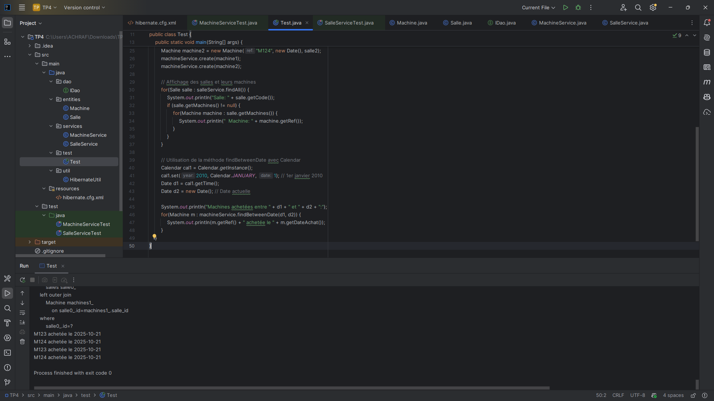
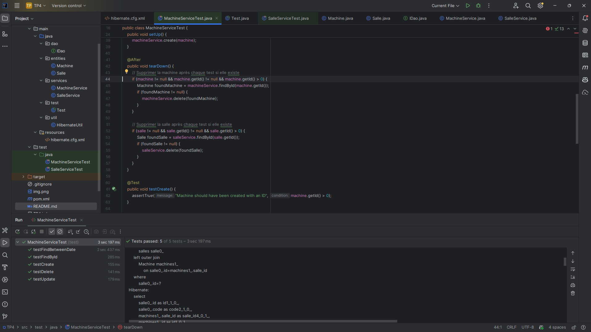
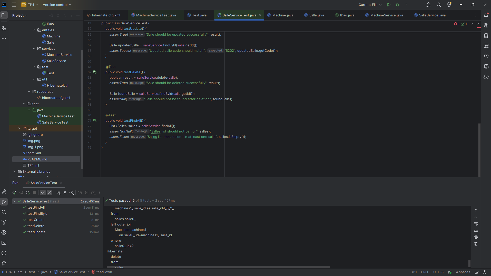

# Gestion de Machines et Salles avec Hibernate


## 📋 Description

Projet Java utilisant **Hibernate ORM** pour la gestion d'une base de données MySQL. L'application gère les entités **Machine** et **Salle** avec une relation **Many-to-One**.

## 🏗️ Architecture du Projet

```
TP4/
├── src/
│   ├── main/
│   │   ├── java/
│   │   │   ├── dao/
│   │   │   │   └── IDao.java                 # Interface générique DAO
│   │   │   ├── entities/
│   │   │   │   ├── Machine.java              # Entité Machine
│   │   │   │   └── Salle.java                # Entité Salle
│   │   │   ├── services/
│   │   │   │   ├── MachineService.java       # Service CRUD pour Machine
│   │   │   │   └── SalleService.java         # Service CRUD pour Salle
│   │   │   ├── test/
│   │   │   │   └── Test.java                 # Classe de test principale
│   │   │   └── util/
│   │   │       └── HibernateUtil.java        # Configuration Hibernate
│   │   └── resources/
│   │       └── hibernate.cfg.xml             # Configuration Hibernate
│   └── test/
│       └── java/
│           ├── MachineServiceTest.java       # Tests unitaires Machine
│           └── SalleServiceTest.java         # Tests unitaires Salle
├── pom.xml                                   # Configuration Maven
└── README.md
```

## 🚀 Fonctionnalités

### Entités

#### Machine
- `id` : Identifiant unique (Integer, auto-généré)
- `ref` : Référence de la machine (String)
- `dateAchat` : Date d'achat (Date)
- `salle` : Salle associée (ManyToOne)

#### Salle
- `id` : Identifiant unique (Integer, auto-généré)
- `code` : Code de la salle (String)
- `machines` : Liste des machines (OneToMany)

### Opérations CRUD

- ✅ **Create** : Création d'entités
- ✅ **Read** : Recherche par ID, recherche de toutes les entités
- ✅ **Update** : Mise à jour d'entités
- ✅ **Delete** : Suppression d'entités
- ✅ **Recherche personnalisée** : Recherche de machines entre deux dates

## 📦 Prérequis

- **Java JDK** 21 ou supérieur
- **Maven** 3.x
- **MySQL** 8.0 ou supérieur
- **IDE** (IntelliJ IDEA, Eclipse, VS Code, etc.)

## 🔧 Installation

### 1. Cloner le projet

```bash
git clone <url-du-repo>
cd TP4
```

### 2. Configurer MySQL

Assurez-vous que MySQL est installé et en cours d'exécution.

**Option 1 : Création automatique**
La base de données `tp4_db` sera créée automatiquement au premier lancement.

**Option 2 : Création manuelle**
```sql
CREATE DATABASE tp4_db;
```

### 3. Configuration de la base de données

Le fichier `src/main/resources/hibernate.cfg.xml` contient la configuration par défaut :

```xml
<property name="hibernate.connection.url">
    jdbc:mysql://localhost:3306/tp4_db?createDatabaseIfNotExist=true&amp;useSSL=false&amp;serverTimezone=UTC
</property>
<property name="hibernate.connection.username">root</property>
<property name="hibernate.connection.password"></property>
```

**⚠️ Important** : Si votre utilisateur MySQL a un mot de passe, modifiez la ligne :
```xml
<property name="hibernate.connection.password">votre_mot_de_passe</property>
```

### 4. Compiler le projet

```bash
mvn clean install
```

## 📸 Screenshots

### Application en Fonctionnement










> **Note** : Les captures d'écran sont disponibles dans le dossier `screenshots/` à la racine du projet.

## 🎯 Utilisation

### Exécuter l'application principale

```bash
mvn exec:java -Dexec.mainClass="test.Test"
```

Ou depuis votre IDE, exécutez la classe `test.Test`.

### Exécuter les tests unitaires

```bash
mvn test
```

**Résultat attendu :**
```
Tests run: 10, Failures: 0, Errors: 0, Skipped: 0
BUILD SUCCESS
```

## 💻 Exemples de Code

### Créer une Salle et une Machine

```java
SalleService salleService = new SalleService();
MachineService machineService = new MachineService();

// Créer une salle
Salle salle = new Salle("A101");
salleService.create(salle);

// Créer une machine
Machine machine = new Machine("M001", new Date(), salle);
machineService.create(machine);
```

### Rechercher toutes les Salles

```java
List<Salle> salles = salleService.findAll();
for(Salle salle : salles) {
    System.out.println("Salle: " + salle.getCode());
    for(Machine machine : salle.getMachines()) {
        System.out.println("  Machine: " + machine.getRef());
    }
}
```

### Rechercher des Machines par période

```java
Calendar cal = Calendar.getInstance();
cal.set(2024, Calendar.JANUARY, 1);
Date dateDebut = cal.getTime();
Date dateFin = new Date();

List<Machine> machines = machineService.findBetweenDate(dateDebut, dateFin);
for(Machine m : machines) {
    System.out.println(m.getRef() + " achetée le " + m.getDateAchat());
}
```

### Mettre à jour une Salle

```java
Salle salle = salleService.findById(1);
salle.setCode("B202");
salleService.update(salle);
```

### Supprimer une Machine

```java
Machine machine = machineService.findById(1);
machineService.delete(machine);
```

## 🧪 Tests

Le projet inclut 10 tests unitaires JUnit :

### Tests MachineService (5 tests)
- ✅ `testCreate` : Création d'une machine
- ✅ `testFindById` : Recherche par ID
- ✅ `testUpdate` : Mise à jour
- ✅ `testDelete` : Suppression
- ✅ `testFindBetweenDate` : Recherche par période

### Tests SalleService (5 tests)
- ✅ `testCreate` : Création d'une salle
- ✅ `testFindById` : Recherche par ID
- ✅ `testFindAll` : Liste complète
- ✅ `testUpdate` : Mise à jour
- ✅ `testDelete` : Suppression

## 📊 Schéma de Base de Données

```sql
-- Table salles
CREATE TABLE salles (
    id INT AUTO_INCREMENT PRIMARY KEY,
    code VARCHAR(255)
);

-- Table Machine
CREATE TABLE Machine (
    id INT AUTO_INCREMENT PRIMARY KEY,
    ref VARCHAR(255),
    dateAchat DATE,
    salle_id INT,
    FOREIGN KEY (salle_id) REFERENCES salles(id)
);
```

## 🔍 Requêtes Nommées

### Named Query HQL
```java
@NamedQuery(
    name = "findBetweenDate", 
    query = "from Machine where dateAchat between :d1 and :d2"
)
```

### Named Native Query SQL
```java
@NamedNativeQuery(
    name = "findBetweenDateNative", 
    query = "select * from machine where dateAchat between :d1 and :d2", 
    resultClass = Machine.class
)
```

## 🛠️ Technologies Utilisées

| Technologie | Version | Description |
|------------|---------|-------------|
| Java | 21 | Langage de programmation |
| Hibernate | 5.6.9.Final | Framework ORM |
| MySQL | 8.0.29 | Base de données |
| JPA | 2.2 | API de persistance Java |
| JUnit | 4.13.2 | Framework de tests |
| Maven | 3.x | Gestion des dépendances |

## ⚙️ Configuration Hibernate

### hibernate.cfg.xml

```xml
<hibernate-configuration>
    <session-factory>
        <!-- Configuration de la base de données -->
        <property name="hibernate.dialect">org.hibernate.dialect.MySQL8Dialect</property>
        <property name="hibernate.connection.driver_class">com.mysql.cj.jdbc.Driver</property>
        <property name="hibernate.connection.url">
            jdbc:mysql://localhost:3306/tp4_db?createDatabaseIfNotExist=true&amp;useSSL=false&amp;serverTimezone=UTC
        </property>
        <property name="hibernate.connection.username">root</property>
        <property name="hibernate.connection.password"></property>
        
        <!-- Configuration Hibernate -->
        <property name="hibernate.show_sql">true</property>
        <property name="hibernate.format_sql">true</property>
        <property name="hibernate.hbm2ddl.auto">update</property>
        
        <!-- Mapping des entités -->
        <mapping class="entities.Salle"/>
        <mapping class="entities.Machine"/>
    </session-factory>
</hibernate-configuration>
```

## 🐛 Résolution des Problèmes

### Erreur de connexion MySQL

**Problème** : `Access denied for user 'root'@'localhost'`

**Solution** : Vérifiez le mot de passe dans `hibernate.cfg.xml`

### Base de données non créée

**Problème** : `Unknown database 'tp4_db'`

**Solution** : Le paramètre `createDatabaseIfNotExist=true` devrait créer la base automatiquement. Sinon, créez-la manuellement :
```sql
CREATE DATABASE tp4_db;
```

### Erreur de driver MySQL

**Problème** : `Loading class 'com.mysql.jdbc.Driver'. This is deprecated.`

**Solution** : Utilisez `com.mysql.cj.jdbc.Driver` (déjà configuré dans le projet)

## 📝 Bonnes Pratiques Implémentées

- ✅ **Pattern DAO** : Séparation de la logique d'accès aux données
- ✅ **Gestion des transactions** : Commit/Rollback appropriés
- ✅ **Fermeture des ressources** : Try-finally pour fermer les sessions
- ✅ **Tests unitaires** : Couverture complète des opérations CRUD
- ✅ **Named Queries** : Requêtes réutilisables et optimisées
- ✅ **Eager Loading** : Chargement des relations pour éviter LazyInitializationException

## 👤 Auteur

**ACHRAF**


---

